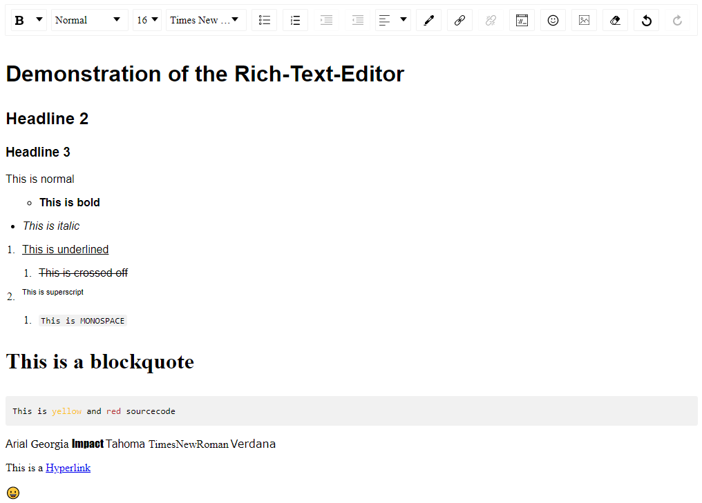
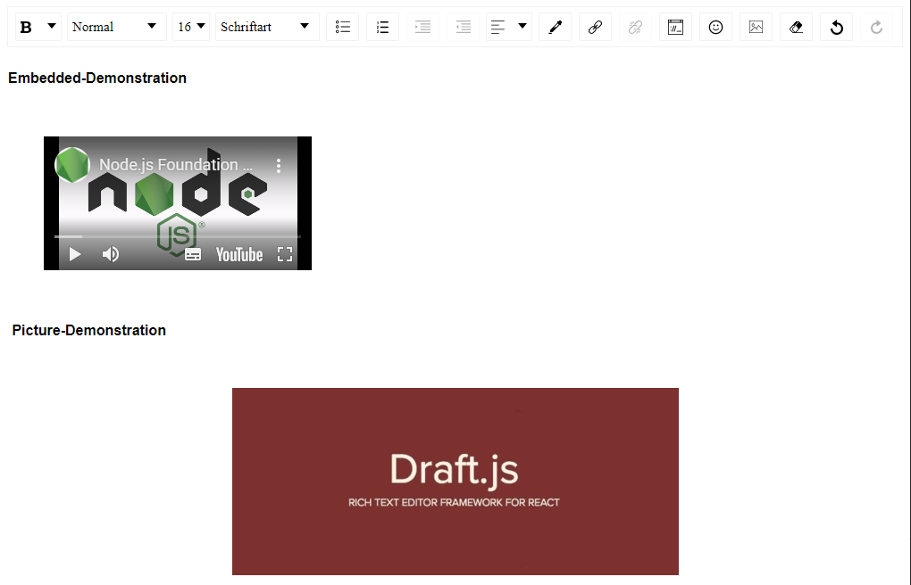

# RichTextEditor-React Komponente

## Feature Demo

### Text-Editing



### Embedded-Media



## Getting started

1. The following packages must be installed:

  1. `@types/draft-js@~0.10.44`
  2. `@types/draftjs-to-html@~0.8.0`
  3. `@types/html-to-draftjs@~1.4.0`
  4. `@types/react-draft-wysiwyg@~1.13.0`
  5. `draft-js@~0.11.7`
  6. `draftjs-to-html@~0.9.1`
  7. `html-to-draftjs@~1.5.0`
  8. `react-draft-wysiwyg@~1.14.5`

2. Copy the folder [richtexteditor](./richtexteditor) into your project.

## How do I use the component in my project?

Add import:

```typescriptreact
import RichTextEditor from '[PATH_TO_THE_COPIED_FOLDER]/RichTextEditor';
```

Implement the Rich-Text-Editor:

```typescriptreact
ReactDOM.render(
    <RichTextEditor
      {...YOUR_SELECTED_PROPERTIES}
    />
  document.getElementById('root')
);
```

Done!

## Example-Project

Navigate into the folder [Examples\ReactApp](./Examples/ReactApp) and run `npm i` to install the necesarry node-modules. Afterwards run `npm run start` to start start the project.

Then navigate to the [Web-App](http://localhost:3000).

## Add support for rendering images

In order to add support for rendering images when manipulating HTML whit the RichTextEditor add the `ImageDecorator` to the `customDecorators` property of the RichTextEditor.

Example:

```typescriptreact
import React from 'react';
import ReactDOM from 'react-dom';
import RichTextEditor from './RichTextEditor/RichTextEditor';
import { ImageDecorator } from './RichTextEditor/ImageDecorator';

ReactDOM.render(
  <RichTextEditor
    customDecorators={[ImageDecorator]}
  />,
  document.getElementById('root')
);
```

## Adjust-Toolbar-Options

In order to adjust the toolbar options of the editor set the `toolbarOptions` property of the Rich Text editor as discribed [here](https://jpuri.github.io/react-draft-wysiwyg/#/docs?_k=jjqinp) or modify/copy the Default-Toolbar-Options in [DefaultToolbar.ts](./richtexteditor/DefaultToolbar.ts)

Example:

```typescriptreact
import React from 'react';
import ReactDOM from 'react-dom';
import RichTextEditor from './RichTextEditor/RichTextEditor';
import { ImageDecorator } from './RichTextEditor/ImageDecorator';

ReactDOM.render(
  <RichTextEditor
    toolbarOptions={
      {
        options: ['inline', 'blockType', 'fontSize', 'remove', 'history'],
        inline: {
          inDropdown: true,
          options: ['bold', 'italic', 'underline', 'strikethrough', 'monospace', 'superscript', 'subscript']
        },
        blockType: {
          inDropdown: true,
          options: ['Normal', 'H1', 'H2', 'H3', 'H4', 'H5', 'H6', 'Blockquote', 'Code']
        },
        fontSize: {
          options: [8, 9, 10, 11, 12, 14, 16, 18, 24, 30, 36, 48, 60, 72, 96],
          inDropdown: true,
        },
        history: {
          inDropdown: false,
          options: ['undo', 'redo'],
        },
      }
    }
  />,
  document.getElementById('root')
);
```

## Generate HTML-Output

In order to get the generated HTML-Output implement the `onChangeHTML`-Method.

Example:

```typescriptreact
import React from 'react';
import ReactDOM from 'react-dom';
import RichTextEditor from './RichTextEditor/RichTextEditor';
import { ImageDecorator } from './RichTextEditor/ImageDecorator';

ReactDOM.render(
  <RichTextEditor
    onChangeHTML={(html: string)=>{ console.log("HTML: ", html); }}
  />,
  document.getElementById('root')
);
```

## API-Documentation

### disabled

- Description: indicates if the component should be disabled
- Type: boolean
- Required: no
- Default value: false

### initialHtml

- Description: the content as html to display initially
- Type: string
- Required: no
- Default value: undefined

### onChangeHTML

- Description: Callback when the content changes. Format: `html`
- Type: (HTMLContents: string) => void;
- Required: no
- Default value: undefined

### onChangeRaw

- Description: Callback when the content changes. Format: `RawDraftContentState`
- Type: (RawContents: RawDraftContentState) => void;
- Required: no
- Default value: undefined

### html

- Description: Used to set the content of the component and override the initial statemanagement (Can be used in combination with `onChangeHtml`)
- Type: string
- Required: no
- Default value: undefined

### raw

- Description: Used to set the content of the component and override the initial statemanagement (Can be used in combination with `onChangeRaw`)
- Type: RawDraftContentState
- Required: no
- Default value: undefined

### toolbarOptions

- Description: the toolbar-options for the editor
- Type: *
- Required: no
- Default value: DefaultToolbar

### locale

- Description: the localisation of the editor. Possible options: en, fr, zh, ru, pt, ko, it, nl, de, da, zh_tw, pl, es.
- Type: RichTextEditorLocales
- Required: no
- Default value: German

### mention

- Description: used to add mention features
- Type: Mention
- Required: no
- Default value: undefined

### customDecorators

- Description: Used for adding custom block rendering
- Type: CustomDecorator[]
- Required: no
- Default value: []

### style

- Description: the style of the component
- Type: React.CSSProperties
- Required: no
- Default value: undefined

## Toolbar options:

The standard toolbar options are listed here:

1. font style
2. text type
3. text size
4. font
5. list options
6. text alignment
7. color options
8. add a link
9. add embedded video
10. emoji
11. add image (by default converted and saved in Base64)
12. delete formatting
13. back and forth

The default configuration is as follows and can be customized.

```typescriptreact
export const DefaultToolbar = {
  options: ['inline', 'blockType', 'fontSize', 'fontFamily', 'list', 'textAlign', 'colorPicker', 'link', 'embedded', 'emoji', 'image', 'remove', 'history'],
  inline: {
    inDropdown: true,
    className: undefined,
    component: undefined,
    dropdownClassName: undefined,
    options: ['bold', 'italic', 'underline', 'strikethrough', 'monospace', 'superscript', 'subscript'],
  },
  block- Type: {
    inDropdown: true,
    options: ['Normal', 'H1', 'H2', 'H3', 'H4', 'H5', 'H6', 'Blockquote', 'Code'],
    className: undefined,
    component: undefined,
    dropdownClassName: undefined,
  },
  fontSize: {
    options: [8, 9, 10, 11, 12, 14, 16, 18, 24, 30, 36, 48, 60, 72, 96],
    className: undefined,
    component: undefined,
    dropdownClassName: undefined,
    inDropdown: true,
  },
  fontFamily: {
    default: "Arial",
    options: ['Arial', 'Georgia', 'Impact', 'Tahoma', 'Times New Roman', 'Verdana'],
    className: undefined,
    component: undefined,
    dropdownClassName: undefined,
    inDropdown: true,
  },
  list: {
    inDropdown: false,
    className: undefined,
    component: undefined,
    dropdownClassName: undefined,
    options: ['unordered', 'ordered', 'indent', 'outdent'],
  },
  textAlign: {
    inDropdown: true,
    className: undefined,
    component: undefined,
    dropdownClassName: undefined,
    options: ['left', 'center', 'right', 'justify'],
  },
  colorPicker: {
    // icon: ColorPic,
    inDropdown: false,
    className: undefined,
    component: undefined,
    popupClassName: undefined,
    colors: ['rgb(26,188,156)', 'rgb(84,172,210)',
      'rgb(147,101,184)', 'rgb(71,85,119)', 'rgb(204,204,204)', 'rgb(0,168,133)',
      'rgb(61,142,185)', 'rgb(41,105,176)', 'rgb(85,57,130)', 'rgb(40,50,78)', 'rgb(0,0,0)',
      'rgb(251,160,38)', 'rgb(235,107,86)', 'rgb(226,80,65)', 'rgb(163,143,132)',
      'rgb(255,255,255)', 'rgb(250,197,28)', 'rgb(243,121,52)',
      'rgb(184,49,47)', 'rgb(124,112,107)'],
  },
  link: {
    inDropdown: false,
    className: undefined,
    component: undefined,
    popupClassName: undefined,
    dropdownClassName: undefined,
    showOpenOptionOnHover: false,
    defaultTargetOption: '_self',
    options: ['link', 'unlink'],
    linkCallback: undefined
  },
  emoji: {
    inDropdown: true,
    className: undefined,
    component: undefined,
    popupClassName: undefined,
    emojis: [
      '😀', '😁', '😂', '😃', '😉', '😋', '😎', '😍', '😗', '🤗', '🤔', '😣', '😫', '😴', '😌', '🤓',
      '😛', '😜', '😠', '😇', '😷', '😈', '👻', '😺', '😸', '😹', '😻', '😼', '😽', '🙀', '🙈',
      '🙉', '🙊', '👼', '👮', '🕵', '💂', '👳', '🎅', '👸', '👰', '👲', '🙍', '🙇', '🚶', '🏃', '💃',
      '⛷', '🏂', '🏌', '🏄', '🚣', '🏊', '⛹', '🏋', '🚴', '👫', '💪', '👈', '👉', '👉', '👆', '🖕',
      '👇', '🖖', '🤘', '🖐', '👌', '👍', '👎', '✊', '👊', '👏', '🙌', '🙏', '🐵', '🐶', '🐇', '🐥',
      '🐸', '🐌', '🐛', '🐜', '🐝', '🍉', '🍄', '🍔', '🍤', '🍨', '🍪', '🎂', '🍰', '🍾', '🍷', '🍸',
      '🍺', '🌍', '🚑', '⏰', '🌙', '🌝', '🌞', '⭐', '🌟', '🌠', '🌨', '🌩', '⛄', '🔥', '🎄', '🎈',
      '🎉', '🎊', '🎁', '🎗', '🏀', '🏈', '🎲', '🔇', '🔈', '📣', '🔔', '🎵', '🎷', '💰', '🖊', '📅',
      '✅', '❎', '💯',
    ],
  },
  embedded: {
    inDropdown: true,
    className: undefined,
    component: undefined,
    popupClassName: undefined,
    embedCallback: undefined,
    defaultSize: {
      height: 'auto',
      width: 'auto',
    },
  },
  image: {
    className: undefined,
    component: undefined,
    popupClassName: undefined,
    urlEnabled: true,
    uploadEnabled: true,
    alignmentEnabled: false,
    uploadCallback: async (file) => { return { data: { link: await convertFileToBase64String(file) } } },
    previewImage: true,
    inputAccept: 'image/gif,image/jpeg,image/jpg,image/png,image/svg',
    alt: { present: false, mandatory: false },
    defaultSize: {
      height: 'auto',
      width: 'auto',
    },
  },
  remove: {
    className: undefined,
    component: undefined
  },
  history: {
    inDropdown: false,
    className: undefined,
    component: undefined,
    dropdownClassName: undefined,
    options: ['undo', 'redo'],
  },
}
```

## Dependencies:

### 1\. @types/draft-js@^0.10.44

[NPM](https://www.npmjs.com/package/@types/draft-js)

Typing for the package: `draft-js`

License: [MIT](https://github.com/DefinitelyTyped/DefinitelyTyped/blob/master/LICENSE)

### 2\. @types/draftjs-to-html@^0.8.0

[NPM](https://www.npmjs.com/package/@types/draftjs-to-html)

Typing for the package: `draftjs-to-html`

License: [MIT](https://github.com/DefinitelyTyped/DefinitelyTyped/blob/master/LICENSE)

### 3\. @types/html-to-draftjs@^1.4.0

[NPM](https://www.npmjs.com/package/@types/html-to-draftjs)

Typing for the package: `html-to-draftjs`

License: [MIT](https://github.com/DefinitelyTyped/DefinitelyTyped/blob/master/LICENSE)

### 4\. @types/react-draft-wysiwyg@^1.13.0

[NPM](https://www.npmjs.com/package/@types/react-draft-wysiwyg)

Typing for the package: `react-draft-wysiwyg`

License: [MIT](https://github.com/DefinitelyTyped/DefinitelyTyped/blob/master/LICENSE)

### 5\. draft-js@^0.11.7

[NPM](https://www.npmjs.com/package/draft-js)

Draft.js is a JavaScript rich text editor framework, built for React and backed by an immutable model.

License: [MIT](https://github.com/facebook/draft-js/blob/master/LICENSE)

### 6\. draftjs-to-html@^0.9.1

[NPM](https://www.npmjs.com/package/draftjs-to-html)

A library for converting DraftJS Editor content to plain HTML.

License: [MIT](https://github.com/jpuri/draftjs-to-html/blob/master/LICENSE)

### 7\. html-to-draftjs@^1.5.0

[NPM](https://www.npmjs.com/package/html-to-draftjs)

A library for converting plain HTML to DraftJS Editor content. Build for use with [react-draft-wysiwyg](https://www.npmjs.com/package/react-draft-wysiwyg).

License: [MIT](https://github.com/jpuri/html-to-draftjs/blob/master/LICENSE)

### 8\. react-draft-wysiwyg@^1.14.5

[NPM](https://www.npmjs.com/package/react-draft-wysiwyg)

A WYSIWYG editor built using ReactJS and DraftJS libraries.

#### Features

- Configurable toolbar with option to add/remove controls.
- Option to change the order of the controls in the toolbar.
- Option to add custom controls to the toolbar.
- Option to change styles and icons in the toolbar.
- Option to show toolbar only when editor is focused.
- Support for inline styles: Bold, Italic, Underline, StrikeThrough, Code, Subscript, Superscript.
- Support for block types: Paragraph, H1 - H6, Blockquote, Code.
- Support for setting font-size and font-family.
- Support for ordered / unordered lists and indenting.
- Support for text-alignment.
- Support for coloring text or background.
- Support for adding / editing links
- Choice of more than 150 emojis.
- Support for mentions.
- Support for hashtags.
- Support for adding / uploading images.
- Support for aligning images, setting height, width.
- Support for Embedded links, flexibility to set height and width.
- Option provided to remove added styling.
- Option of undo and redo.
- Configurable behavior for RTL and Spellcheck.
- Support for placeholder.
- Support for WAI-ARIA Support attributes
- Using editor as controlled or un-controlled React component.
- Support to convert Editor Content to HTML, JSON, Markdown.
- Support to convert the HTML generated by the editor back to editor content.
- Support for internationalization.

License: [MIT](https://github.com/jpuri/react-draft-wysiwyg/blob/master/LICENSE)
